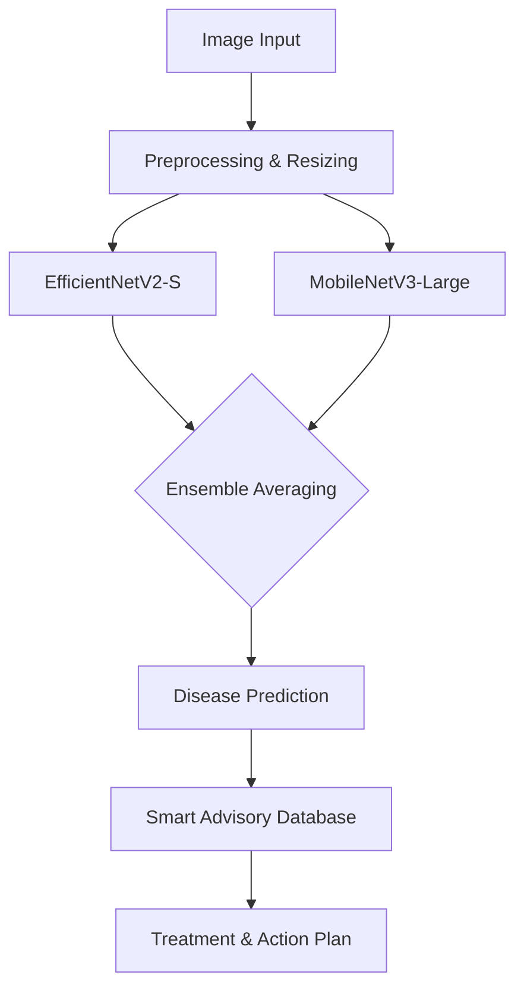

# Crop Disease Prediction and Smart Advisory Platform

---

## Slide 1: Introduction
### Context and Importance in Agriculture
* **The Global Challenge**: Crop diseases are a major threat to global food security, causing estimated annual yield losses of 20-30% worldwide.
* **Impact on Farmers**: For farmers, especially in regions like India, a disease outbreak can mean devastating financial losses, leading to debt and livelihood insecurity.
* **The Need for Early Detection**: Identifying diseases at early stages is critical. It allows for targeted intervention, minimizing crop damage, reducing pesticide overuse, and ensuring higher agricultural productivity.

---

## Slide 2: Problem Statement
### Challenges in Traditional Agriculture
* **Limitations of Manual Detection**: Traditional disease identification relies on visual inspection by farmers or scarce agricultural experts. This process is slow, subjective, and highly prone to human error.
* **Late Diagnosis**: By the time symptoms are visually obvious and correctly identified manually, the disease has often spread extensively, making treatments less effective and more expensive.
* **The Need for AI**: Farmers lack accessible, real-time, and highly accurate diagnostic tools. There is an urgent need for an automated, AI-driven solution that provides immediate and reliable crop health assessments directly to the farmer's mobile device.

---

## Slide 3: Proposed System
### An Integrated AI and Agritech Solution
* **Core Concept**: A comprehensive platform combining deep learning for instant image-based disease detection with a smart advisory system for actionable agricultural intelligence.
* **Disease Detection Engine**: Farmers upload photos of crop leaves. The system instantly processes the image to identify the specific crop and any present diseases.
* **Smart Advisory System**: Beyond just identification, the platform provides tailored recommendations for treatment (pesticides, biological controls), immediate actions to prevent spread, and long-term yield impact analysis.
* **Goal**: To empower farmers with an "expert in their pocket."

---

## Slide 4: Dataset & Preprocessing
### Data Foundation for Robust AI
* **Dataset Used**: We utilized the PlantVillage dataset, heavily customized to focus on regionally relevant agriculture (e.g., Apple, Corn, Grape, Potato, Tomato, Rice, Wheat).
* **Dataset Scale**: The model is trained to recognize **28 distinct classes** (crop-disease combinations), with the evaluation test set containing **3,928 samples**.
* **Advanced Preprocessing for Real-World Accuracy**:
    * **Resizing & Normalization**: Standardized inputs (224x224) using ImageNet mean/std to stabilize training.
    * **Heavy Field Augmentation**: To simulate real-world phone photos, we applied dynamic lighting changes, Gaussian blurs (simulating shaky hands), and weather simulations (shadows, sun flares, fog) during training.

---

## Slide 5: Model Used (Deep Learning)
### High-Performance Image Classification
* **Architecture**: An **Ensemble Model** combining **EfficientNetV2-S** and **MobileNetV3-Large**.
* **Why this combination?**
    * *EfficientNetV2* provides highly robust feature extraction and top-tier accuracy.
    * *MobileNetV3* ensures lightweight, exceptionally fast inference suitable for edge deployment or rapid API responses.
* **Transfer Learning**: We utilized models pre-trained on ImageNet, fine-tuning the deeper layers specifically on our augmented agricultural dataset. This significantly accelerated convergence and improved accuracy on plant textures.

  

---

## Slide 6: System Architecture
### From Leaf to Treatment
* **Input Layer**: Farmer uploads an image via the frontend interface (Web/Mobile).
* **Preprocessing Pipeline**: The image is resized, center-cropped, and normalized before being fed to the model.
* **Inference Engine**: The augmented image is processed by the EfficientNet + MobileNet ensemble model.
* **Prediction Output**: The model outputs probability scores across the 28 classes, identifying the highest confidence disease.
* **Advisory Generation**: The predicted disease class is mapped against an agronomic database to retrieve specific treatments, immediate actions, and prevention strategies.

---

## Slide 7: Evaluation Metrics
### Measuring Success
* **Accuracy**: **99.34%** (Overall correctness on the test set)
* **Precision (Macro / Weighted)**: **0.9928** / **0.9935** (Extremely low false alarm rate)
* **Recall (Macro / Weighted)**: **0.9918** / **0.9934** (Successfully detecting almost all sick plants)
* **F1-Score (Macro / Weighted)**: **0.9923** / **0.9934** (Exceptional balance across all 28 classes)
* **Confusion Matrix**: A visual table used to understand exactly where the model gets confused (e.g., misclassifying Early Blight vs. Late Blight), guiding future improvements.

  

---

## Slide 8: Results & Output
### State-of-the-Art Performance
* **Overall Accuracy**: **99.34%** on the holdout test set (3,928 images).
* **Macro F1-Score**: **0.9923** (demonstrating excellent performance across all 28 classes, not just the majority ones).
* **Speed**: Average prediction time is exceptionally fast at **124 milliseconds** per image.
* **Class-Specific Highlights**: Achieved perfect 1.000 F1-scores on critical diseases like Apple Scab, Cedar Apple Rust, and Tomato Late Blight.
* **Training Validation**: The model converged smoothly without overfitting, thanks to our aggressive data augmentation strategies.

  
  

---

## Slide 9: Smart Advisory System
### Translating AI into Agronomic Action
* **Beyond Classification**: Knowing the disease is only step one. The advisory system tells the farmer exactly what to do next.
* **Tailored Recommendations**: 
    * *Example - Tomato Late Blight*: 
        * **Immediate Action**: Remove and destroy infected plants immediately. Do not compost.
        * **Treatment**: Apply Copper-based fungicides or Chlorothalonil early in the morning.
        * **Prevention**: Ensure proper plant spacing for airflow; avoid overhead watering.
* **Real-World Benefits**: Reduces guesswork, prevents the misuse of incorrect chemicals, saves money on unnecessary fertilizers, and ultimately protects crop yields.

---

## Slide 10: Conclusion & Future Scope
### The Road Ahead
* **Summary**: We have successfully built a highly accurate (99.3%+), robust, and fast AI ensemble model capable of detecting 28 crop diseases, paired with an actionable advisory system to directly support farmers.
* **Future Scope**:
    * **Mobile App Integration**: Deploying the model directly onto edge devices (smartphones) via TensorFlow Lite for offline detection in remote farms.
    * **IoT Integration**: Connecting the advisory platform to local soil moisture and weather sensors to predict disease outbreaks *before* visual symptoms appear.
    * **Continuous Learning**: Implementing a feedback loop where farmer-verified images continually retrain and improve the model over time.
