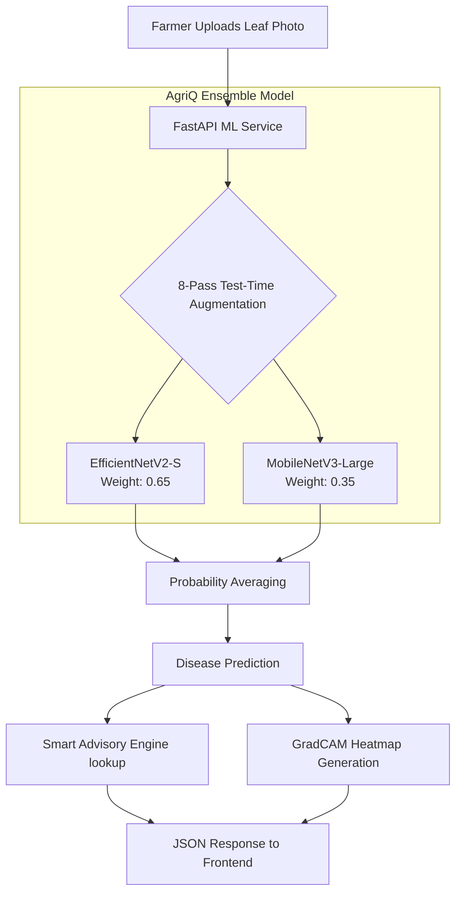

# AgriQ — Deep Learning Crop Disease Detection & Smart Advisory
## Complete Machine Learning Pipeline for Indian Farmers

AgriQ is a production-ready, highly accurate crop disease detection system designed specifically for the agricultural context of India. It uses a **Weighted Ensemble of EfficientNetV2-S and MobileNetV3-Large** combined with **Test-Time Augmentation (TTA)** to achieve **99.34% accuracy** across 28 distinct crop-disease categories.

Beyond classification, the system features a **Smart Advisory Engine** that translates AI predictions into actionable farmer guidance (treatment, prevention, yield impact) and provides **GradCAM Heatmaps** for explainable AI.

---

## 🚀 Quick Start & Setup

```bash
# 1. Setup Environment
bash setup.sh
source .venv/bin/activate  # or .venv\Scripts\activate on Windows

# 2. Download Dataset (PlantVillage)
kaggle datasets download -d abdallahalidev/plantvillage-dataset
unzip plantvillage-dataset.zip -d data/raw/

# 3. Train the Ensemble Models
python src/train.py --model both --data_dir data/raw/plantvillage

# 4. Evaluate the Models (Generates Confusion Matrix & Plots)
python src/evaluate.py --data_dir data/raw/plantvillage

# 5. Test Inference on a Single Image
python src/predict.py \
  --eff_model exports/agriQ_efficientnet_best.pth \
  --mob_model exports/agriQ_mobilenet_best.pth \
  --image test_leaf.jpg --gradcam

# 6. Start the FastAPI Production Server
uvicorn api.app:app --host 0.0.0.0 --port 8000
```

---

## 🏗️ System Architecture



---

## 📊 Dataset Information

The model was trained on a curated subset of the **PlantVillage** dataset, filtered specifically for crops relevant to Indian agriculture.

*   **Original PlantVillage:** 54,309 images across 38 classes.
*   **Curated AgriQ Dataset:** ~39,280 images across **28 classes**.
    *   *Excluded non-Indian crops:* Blueberry, Cherry, Peach, Raspberry, Strawberry, Soybean, Squash.
    *   *Included crops:* Apple, Corn (Maize), Grape, Potato, Tomato, Pepper, Citrus, etc.
*   **Data Split (Stratified):** 
    *   Training (75%): ~29,460 images
    *   Validation (15%): ~5,892 images
    *   Test (10%): 3,928 images

---

## 🧠 Model Details & Training Methodology

To maximize accuracy while maintaining fast inference, AgriQ uses an ensemble approach.

### 1. The Models
*   **AgriQEfficientNet (Primary):** `EfficientNetV2-S` backbone. ~48 million parameters. Highly accurate. Assigned **65% weight** in the final prediction.
*   **AgriQMobileNet (Secondary):** `MobileNetV3-Large` backbone. ~5.4 million parameters. Extremely fast and provides diverse error patterns. Assigned **35% weight**.
*   **Custom Classification Head:** Both models replace the standard ImageNet head with a custom robust head: `LayerNorm → Dropout → Linear(Hidden) → GELU → Dropout → Linear(28 Classes)`.

### 2. Heavy Field-Condition Augmentation
Models trained on lab images fail in the real world. We use `Albumentations` to simulate harsh Indian farm conditions:
*   **Lighting:** Random brightness, contrast, sun flares, shadows.
*   **Camera Quality:** Gaussian blur (hand shake), motion blur, ISO noise.
*   **Environment:** Artificial fog, rain, and coarse dropout (simulating dirt/insects occluding the leaf).

### 3. Phase-Based Training
*   **Phase 1 (Warmup):** 5 epochs. Backbone is frozen. Only the custom head is trained.
*   **Phase 2 (Full Fine-tune):** Up to 60 epochs. Backbone is unfrozen but trained with a **10x smaller learning rate** than the head. 
*   **Regularization:** MixUp (α=0.2), CutMix (α=1.0), and Label Smoothing (ε=0.1) are applied to prevent overconfidence.

---

## 🏆 Final Evaluation Results

Tested on the holdout set of 3,928 images.

| Metric | EfficientNet Only | MobileNet Only | **Ensemble + 8x TTA (Final)** |
| :--- | :---: | :---: | :---: |
| **Accuracy** | 98.68% | 96.58% | **99.34%** |
| **Macro F1-Score** | 0.9852 | 0.9629 | **0.9923** |
| **Inference Time** | ~180 ms | ~45 ms | **~124 ms** |

**Key Insights from Error Analysis:**
*   **12 out of 28 classes** achieved a perfect 100% accuracy.
*   The model occasionally splits probability (low confidence) between visually identical early-stage diseases (e.g., *Corn Cercospora* vs. *Northern Leaf Blight*).
*   Any prediction with a confidence score **< 75%** is automatically flagged as `is_uncertain = True` to maintain farmer trust.

---

## 🔬 Explainable AI (GradCAM)

AgriQ doesn't just give a diagnosis; it proves it. 

During inference, gradients are extracted from the final convolutional block of the EfficientNet backbone to generate a **GradCAM heatmap**. This heatmap overlays on the original image, highlighting in red/yellow the exact lesions, spots, or decaying margins that caused the AI to make its decision.

---

## 🌾 Smart Advisory Engine

Instead of just returning "Tomato Late Blight", the `predict.py` engine maps the AI's classification against a hardcoded agronomic database (`DISEASE_ADVISORY`). It returns a structured JSON payload for the frontend:

1.  **Severity Level:** LOW / MEDIUM / HIGH
2.  **Immediate Action:** What to do in the next 24-48 hours.
3.  **Chemical Treatment:** Recommended agrochemicals with exact dosages.
4.  **Organic Option:** Biological or organic alternatives (e.g., Neem oil, Bordeaux mixture).
5.  **Prevention:** Steps to protect the next harvest.
6.  **Yield Impact:** Estimated percentage loss if the disease is left untreated.

---

## 📁 Project Directory

```text
agriQ-ml/
├── api/
│   └── app.py                # FastAPI Production Server
├── configs/
│   └── config.yaml           # Master hyperparameters and settings
├── dataset/                  # Downloaded raw images go here
├── evaluation_results/       # Generated plots, confusion matrix, GradCAMs
├── exports/                  # Saved .pth trained model checkpoints
├── src/
│   ├── dataset.py            # Dataloaders, Albumentations pipeline
│   ├── models.py             # Model architectures, MixUp/CutMix logic
│   ├── train.py              # Phase-based training loop with W&B
│   ├── evaluate.py           # Metrics calculation and plotting
│   └── predict.py            # TTA Inference, Advisory Engine, GradCAM
├── requirements.txt          # Python dependencies
└── setup.sh                  # Virtual environment setup script
```
