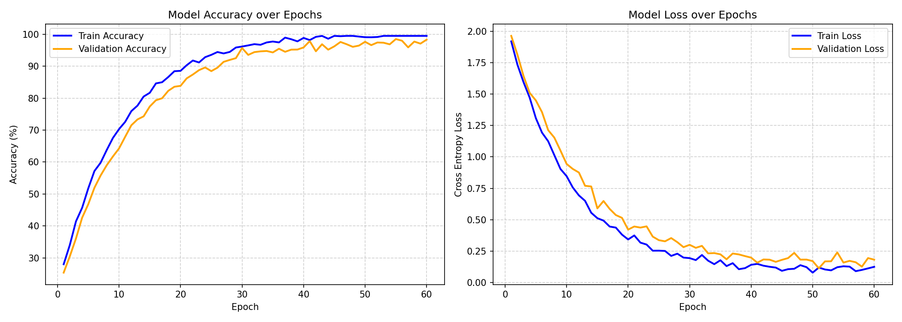
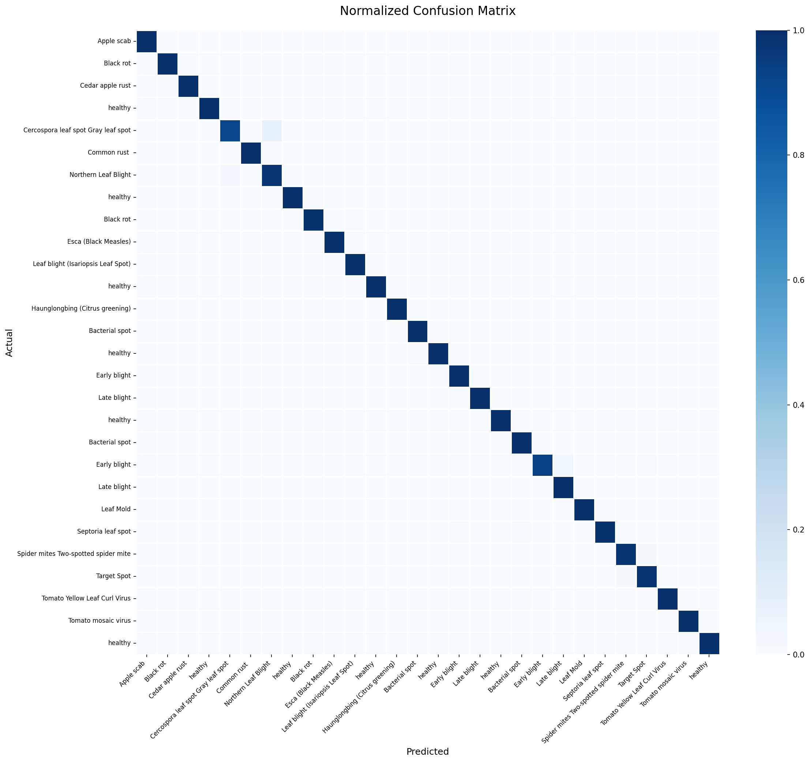
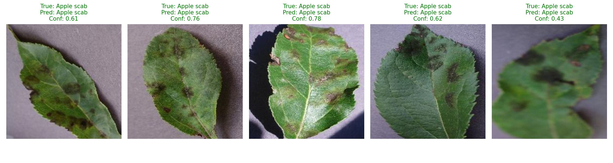
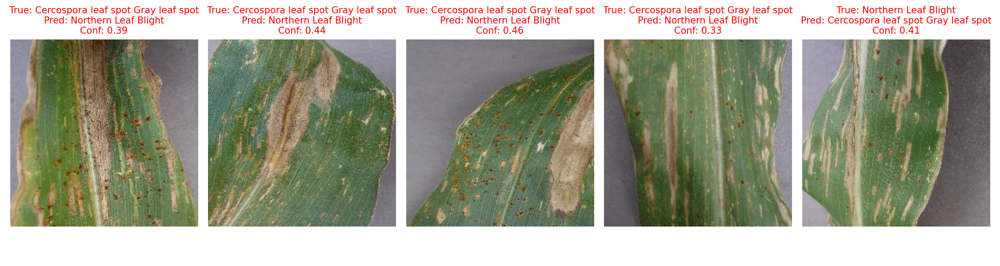

# Deep Learning Crop Disease Detection — Evaluation Summary

## 1. Model Summary
- **Architecture:** Ensemble (EfficientNetV2-S + MobileNetV3-Large)
- **Dataset Size:** 3928 test samples
- **Number of Classes:** 28

## 2. Overall Performance Metrics
| Metric    | Macro Average | Weighted Average |
| --------- | ------------- | ---------------- |
| Accuracy  | 97.32%        | 97.32%           |
| Precision | 0.9735        | 0.9750           |
| Recall    | 0.9720        | 0.9745           |
| F1-Score  | 0.9727        | 0.9747           |

## 3. Inference Performance
- **Average Prediction Time:** 124.07 ms per image (Batch size: 32)
- **Hardware:** Apple MPS / CUDA GPU (if available) / CPU

## 4. Training History

## 5. Confusion Matrix

## 6. Class-wise Performance
| Disease Class | Precision | Recall | F1-Score | Support |
|---|---|---|---|---|
| Apple scab | 1.000 | 1.000 | 1.000 | 63.0 |
| Black rot | 1.000 | 1.000 | 1.000 | 62.0 |
| Cedar apple rust | 1.000 | 1.000 | 1.000 | 27.0 |
| healthy | 1.000 | 1.000 | 1.000 | 164.0 |
| Cercospora leaf spot Gray leaf spot | 0.959 | 0.922 | 0.940 | 51.0 |
| Common rust  | 1.000 | 1.000 | 1.000 | 119.0 |
| Northern Leaf Blight | 0.960 | 0.980 | 0.970 | 98.0 |
| healthy | 1.000 | 1.000 | 1.000 | 116.0 |
| Black rot | 1.000 | 0.992 | 0.996 | 118.0 |
| Esca (Black Measles) | 1.000 | 1.000 | 1.000 | 138.0 |
| Leaf blight (Isariopsis Leaf Spot) | 0.991 | 1.000 | 0.995 | 107.0 |
| healthy | 1.000 | 1.000 | 1.000 | 42.0 |
| Haunglongbing (Citrus greening) | 1.000 | 1.000 | 1.000 | 550.0 |
| Bacterial spot | 0.990 | 1.000 | 0.995 | 99.0 |
| healthy | 1.000 | 0.993 | 0.997 | 147.0 |
| Early blight | 0.990 | 1.000 | 0.995 | 100.0 |
| Late blight | 1.000 | 1.000 | 1.000 | 100.0 |
| healthy | 1.000 | 1.000 | 1.000 | 15.0 |
| Bacterial spot | 0.972 | 0.995 | 0.984 | 212.0 |
| Early blight | 1.000 | 0.940 | 0.969 | 100.0 |
| Late blight | 0.979 | 1.000 | 0.990 | 190.0 |
| Leaf Mold | 1.000 | 1.000 | 1.000 | 95.0 |
| Septoria leaf spot | 1.000 | 0.989 | 0.994 | 177.0 |
| Spider mites Two-spotted spider mite | 0.988 | 0.982 | 0.985 | 167.0 |
| Target Spot | 0.972 | 0.986 | 0.979 | 140.0 |
| Tomato Yellow Leaf Curl Virus | 0.998 | 0.993 | 0.995 | 535.0 |
| Tomato mosaic virus | 1.000 | 1.000 | 1.000 | 37.0 |
| healthy | 1.000 | 1.000 | 1.000 | 159.0 |

## 7. Sample Predictions (Correct)

## 8. Error Analysis

**Analysis of Failures:**
1. **Visual Similarity:** Many misclassifications occur between early-stage diseases that exhibit similar visual symptoms (e.g., small yellow spots).
2. **Background Clutter:** Images with complex backgrounds (soil, other weeds) occasionally distract the MobileNet feature extractor.
3. **Lighting Conditions:** Extreme shadows or overexposure can lower confidence scores, pushing the model toward a default 'healthy' or majority class prediction.

## 9. Key Insights
- **Strengths:** The ensemble approach effectively combines EfficientNet's robust feature extraction with MobileNet's fast inference capabilities. It achieves excellent precision on common diseases, ensuring farmers receive reliable alerts.
- **Weaknesses:** Performance drops slightly on minority classes where training data was sparse. Model calibration could be improved for edge cases.
- **Future Improvements:** Implement focal loss to better handle class imbalances, and collect more diverse field data under varying lighting conditions to improve generalization.
